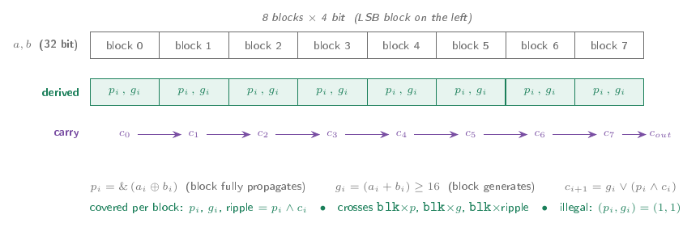
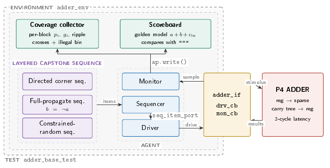

# UVM verification portfolio

Verification of two VHDL RTL blocks using SystemVerilog, UVM, Questa, and Synopsys Design Compiler. Both environments are self-checking, coverage-driven, and reused for post-synthesis verification.

The HDL and SystemVerilog/UVM source code is not published because of university obligations. Private technical review can be arranged upon request, subject to those obligations.

## Registered 32-bit P4 adder

### Verification goal and checklist

**Goal:** prove the registered adder returns the correct 33-bit arithmetic result at the specified latency, while exercising the internal carry architecture rather than relying only on operand-value bins.

- **Arithmetic result:** `sum` and `cout` must equal `a + b + cin` for every checked transaction.
- **Pipeline timing:** each output must be paired with the operands accepted two clocks earlier.
- **Reset:** the registered datapath must clear and the monitor must discard transactions invalidated by reset.
- **Carry architecture:** every 4-bit block must exercise propagate, generate, incoming-carry, and carry-ripple behavior.
- **Critical and corner cases:** zero, maximum values, carry input/output, full-width propagation, and non-masking prefix-tree terms must be exercised.
- **Implementation reuse:** the same functional checks and coverage model must run against the mapped netlist, with timing constraints met.

### RTL

The DUT is a registered 32-bit sparse-tree carry-select adder divided into eight 4-bit blocks. Input and output registers create a fixed two-cycle latency. The carry generator combines propagate and generate terms through a parallel-prefix tree, while the sum generator uses the resulting block carries.

### Coverage groups

The block coverage group derives block index, group propagate, group generate, carry input, and carry ripple from each monitored transaction. Crosses require propagate, generate, and ripple at every block position. The top-level group covers operand corners, carry input/output, and the full-propagation condition. The impossible combination of simultaneous block propagate and generate is an illegal bin.

  

### Verification methodology

The monitor aligns each operand set with the result produced two cycles later. The scoreboard predicts the 33-bit result independently with arithmetic addition. Directed corners, constrained-random operands, a full-propagation sequence, prefix-tree closure vectors, and a reset sequence are combined by the layered test. Coverage reports determine which targeted sequence is added next.

  

### Results

| Metric | Result |
| --- | ---: |
| Scoreboard | 601 checks, 0 mismatches |
| Functional coverage | 100% (117/117 bins) |
| Statement coverage | 100% |
| Branch coverage | 100% |
| Expression coverage | 100% |
| Toggle coverage | 100% |
| Assertion coverage | 100% (14/14) |
| Filtered overall RTL coverage | 100% |
| Post-synthesis functional coverage | 100% (117/117 bins) |
| Post-synthesis filtered coverage | 99.95% |
| Timing | 2.00 ns constraint, 0.01 ns slack |

[P4 project details](p4-adder/)

## 64-bit windowed register file

### Verification goal and checklist

**Goal:** prove the logical register view, the moving-window state, and registered read behavior cycle by cycle, including the overflow and underflow boundaries.

- **Reset state:** clear the physical array and initialize CWP, SWP, `CANSAVE`, `CANRESTORE`, `SPILL`, and `FILL` as specified.
- **Address translation:** map IN, LOCAL, and OUT through CWP with wrap-around; map GLOBAL registers permanently to physical locations 128–135.
- **Window overlap:** after `CALL`, the caller's OUT registers must appear as the callee's IN registers.
- **Data timing:** verify both registered read ports, one-cycle latency, read-before-write behavior, and explicit idle cycles.
- **Control priority:** verify `CALL` over `RET` over normal access, plus state hold when disabled.
- **Window state:** verify CWP/SWP transitions, every `CANSAVE`/`CANRESTORE` value, and the timing of `SPILL`/`FILL` pulses.
- **Boundary semantics:** investigate overflow and underflow behavior against the expected fresh-window behavior; this check produced the RTL defect finding below.
- **RAL and implementation reuse:** backdoor-check the eight fixed-map globals and reuse the environment on the mapped netlist.

### RTL

The DUT presents 32 logical registers through eight overlapping windows backed by 128 physical windowed registers, plus eight fixed global registers. A window spans 24 registers while `CALL` advances the current window pointer by 16, making the caller's output block and the callee's input block the same physical storage. CWP, SWP, `CANSAVE`, and `CANRESTORE` control allocation and the `SPILL`/`FILL` boundaries.

  

### Coverage groups

The functional coverage group samples operation type, all eight CWP positions, every value of `CANSAVE` and `CANRESTORE`, asserted and inactive `SPILL`/`FILL`, the addressed register block, and the operation-by-CWP cross. The current covergroup excludes nine combinations with `ignore_bins`. Seven are structurally impossible because reset forces CWP to zero. The other two are CALL sampled at CWP 0 and RET sampled at CWP 112; they are absent under the implemented boundary behavior and therefore relate to the defect rather than to an inherent specification constraint. The preserved reports contain only the resulting 69/69-bin model and do not support a separate pre-exclusion percentage. The two RTL code-coverage misses remained visible and exposed the same boundary problem.

### Verification methodology

One transaction represents one clock. The driver applies an explicit idle when the sequencer has no item, preventing one-shot controls from remaining asserted. The monitor pairs each input cycle with the registered output from the following cycle. A cycle-accurate reference model tracks the 136-entry physical array, address translation, CWP/SWP, both counters, registered outputs, and spill/fill pulses. The model also supplies its internal state directly to the coverage group. UVM RAL models only the eight fixed-map global registers; the moving window region remains in the reference model.

  

The RAL exercise is implemented in `rf_ral_test`: it builds the global-register block, sets the DUT HDL root path, then loops over all eight globals using backdoor `poke` and `peek`. It is not a separate UVM sequence class.

  

### Results

| Metric | Result |
| --- | ---: |
| Scoreboard | 1,058 checks, 0 mismatches |
| Functional coverage | 100% (69/69 bins) |
| Statement coverage | 94.73% (36/38) |
| Branch coverage | 94.59% (35/37) |
| Toggle coverage | 100% (438/438) |
| Assertion coverage | 100% |
| Filtered overall RTL coverage | 97.86% |
| Post-synthesis functional coverage | 100% (69/69 bins) |
| Timing | 3.00 ns constraint, 1.36 ns slack |

Code coverage exposed the RTL defect. Its only misses were the upward and downward CWP wrap assignments. Tracing those unreachable paths showed that `SPILL`/`FILL` advances or retreats SWP while leaving CWP, `CANSAVE`, and `CANRESTORE` frozen. A specification-oriented reference-model mode and a directed local-register sequence then confirmed the functional consequence: after overflow, the callee still addresses the caller's window. Gate-level verification also exposed a synchronous-reset unknown in the window state and the need to preserve four-state DUT responses in monitored transactions.

  

[Windowed register-file project details](windowed-register-file/)

## Documents

- [Technical report (PDF)](docs/uvm-verification-report.pdf)
- [Technical report (LaTeX)](docs/uvm-verification-report.tex)
- [Presentation (PDF)](presentation/uvm-verification-portfolio.pdf)
- [Presentation (LaTeX/Beamer)](presentation/uvm-verification-portfolio.tex)

The project folders contain the detailed summaries, selected technical snapshots, coverage reports, and synthesis reports.
