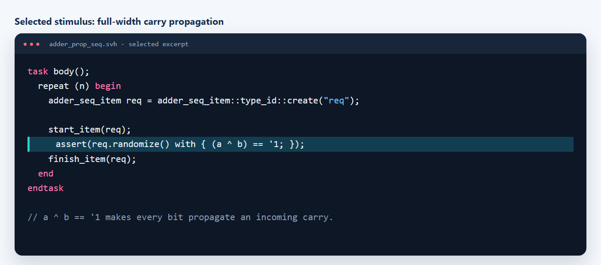
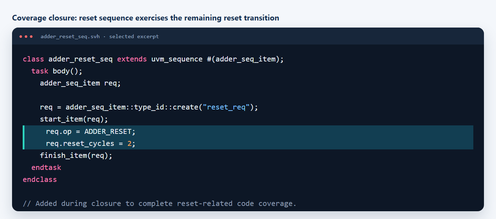
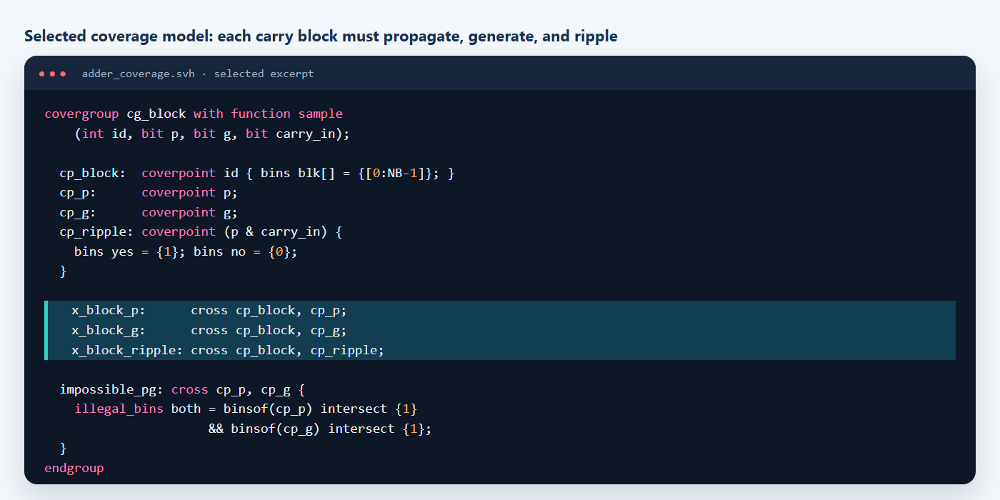

# UVM verification of a registered 32-bit P4 adder

## Verification goal and checklist

**Goal:** prove the registered adder returns the correct 33-bit arithmetic result at the specified two-cycle latency and exercise the carry-tree conditions that can hide behind ordinary random operands.

- arithmetic result: `sum` and `cout` equal `a + b + cin`;
- timing: each result is aligned with operands accepted two clocks earlier;
- reset: registered state clears and reset-invalidated pipeline entries are discarded;
- carry architecture: every 4-bit block exercises propagate, generate, and actual carry ripple;
- critical cases: arithmetic corners, carry input/output, full propagation, and non-masking prefix terms;
- reuse: the same functional checks and coverage model run at RTL and after synthesis.

## Design

The DUT is a registered 32-bit sparse-tree carry-select adder divided into eight 4-bit blocks. Input and output registers create a fixed two-cycle latency.

  
  

## Coverage model

The functional model derives block propagate, block generate, and carry ripple for each 4-bit block. Cross coverage records these conditions at every block position. Top-level bins cover carry input/output, operand corners, and full propagation.

## Results

| Metric | Result |
| --- | ---: |
| Scoreboard | 601 checks, 0 mismatches |
| Functional coverage | 100% (117/117 bins) |
| Statement coverage | 100% |
| Branch coverage | 100% |
| Expression coverage | 100% |
| Toggle coverage | 100% |
| Assertion coverage | 100% (14/14) |
| Filtered overall coverage | 100% |
| Post-synthesis functional coverage | 100% (117/117 bins) |
| Timing | 2.00 ns constraint, 0.01 ns slack |

See the [result summary](results/summary.md) and [report index](reports/README.md).
