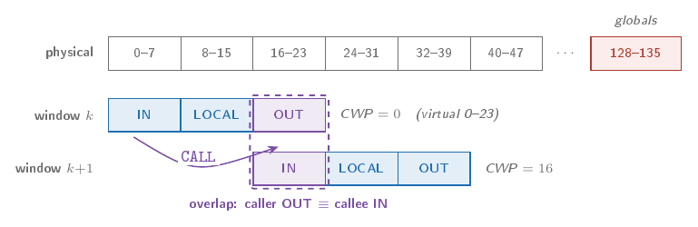
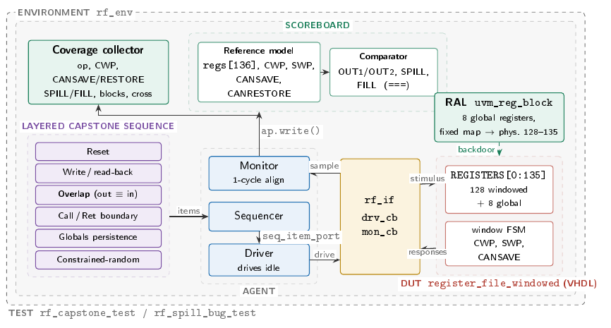
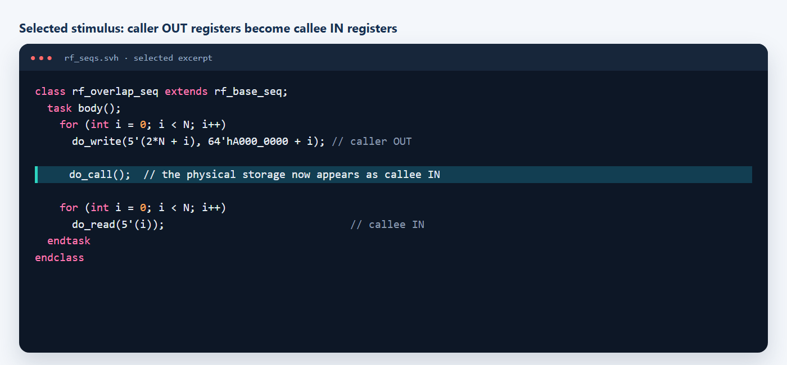
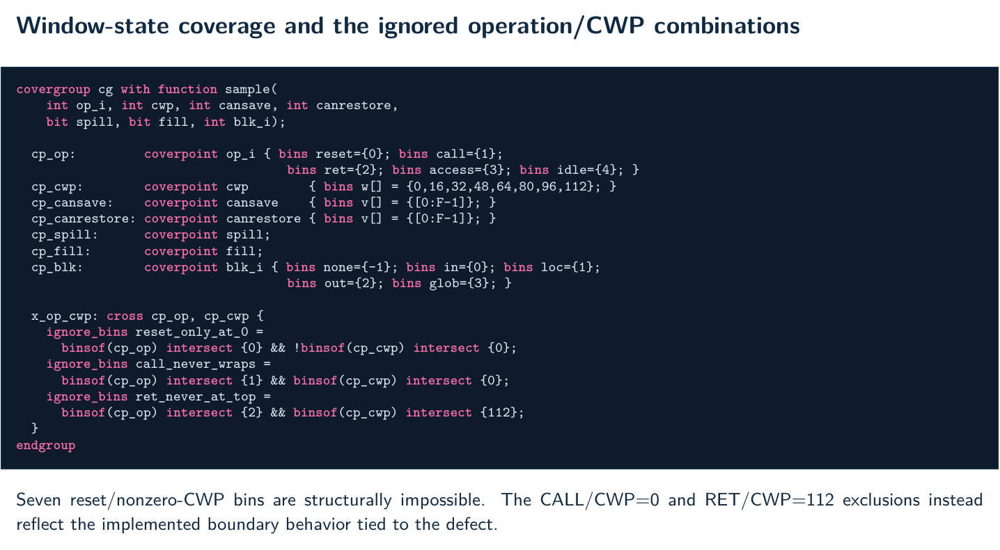
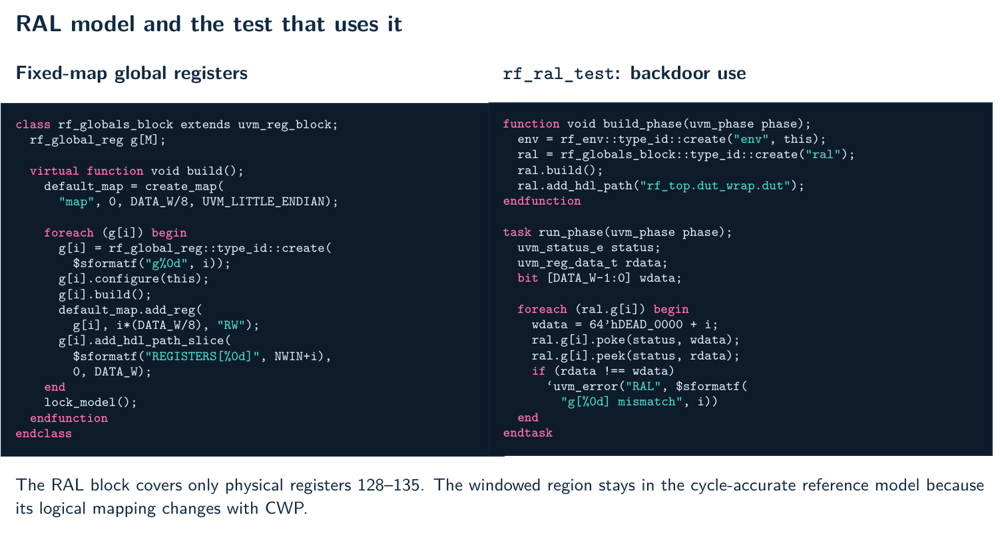
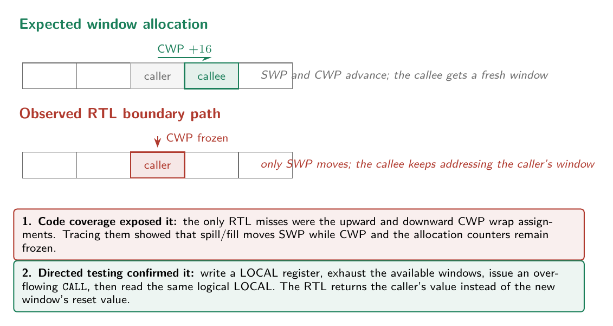

# UVM verification of a windowed register file

## Verification goal and checklist

**Goal:** prove the moving logical-to-physical register view and the complete window-management state cycle by cycle, including the overflow and underflow boundaries.

- reset the physical array, pointers, counters, and boundary flags to the specified values;
- translate IN, LOCAL, and OUT through CWP with wrap-around, while globals remain fixed at physical 128–135;
- prove caller OUT and callee IN share the intended storage after `CALL`;
- verify both registered read ports, one-cycle latency, read-before-write behavior, and explicit idle cycles;
- verify `CALL`/`RET` priority, CWP/SWP transitions, and state hold when disabled;
- exercise every `CANSAVE`/`CANRESTORE` value and both `SPILL`/`FILL` outcomes;
- check overflow/underflow semantics against the expected window allocation behavior;
- backdoor-check the eight fixed-map globals with RAL and reuse the environment after synthesis.

## Design

The DUT is a 64-bit register file with eight overlapping windows, eight global registers, and 136 physical registers. A call advances the current window by 16 registers while a logical window spans 24 registers.

## Coverage and RAL

The functional model covers operation type, current-window position, save/restore counter values, spill/fill events, addressed register block, and operation-by-window crosses. Three `ignore_bins` declarations remove nine operation-by-CWP combinations. Seven reset/nonzero-CWP combinations are structurally impossible. CALL sampled at CWP 0 and RET sampled at CWP 112 are also ignored, but their absence follows from the implemented boundary behavior and relates to the defect. The preserved report shows only the resulting 69/69-bin model, not a before-and-after progression.

UVM RAL models the eight fixed-map global registers. `rf_ral_test` builds the block, adds the DUT HDL root, and performs a backdoor `poke`/`peek` loop over the globals; there is no separate RAL sequence class.

## Results

| Metric | Result |
| --- | ---: |
| Scoreboard | 1,058 checks, 0 mismatches |
| Functional coverage | 100% (69/69 bins) |
| Statement coverage | 94.73% (36/38) |
| Branch coverage | 94.59% (35/37) |
| Toggle coverage | 100% (438/438) |
| Assertion coverage | 100% |
| Filtered overall coverage | 97.86% |
| Post-synthesis functional coverage | 100% (69/69 bins) |
| Timing | 3.00 ns constraint, 1.36 ns slack |

## Defect discovered through code coverage

Code coverage exposed the problem first: the only uncovered statements and branches were the upward and downward CWP wrap assignments. Investigating those misses showed that the spill/fill path moves SWP while CWP, `CANSAVE`, and `CANRESTORE` remain frozen, so the wrap assignments cannot execute. A specification-oriented model and directed LOCAL-register test then confirmed the consequence: after an overflowing `CALL`, the callee still reads the caller's window.

See the [result summary](results/summary.md) and [report index](reports/README.md).
